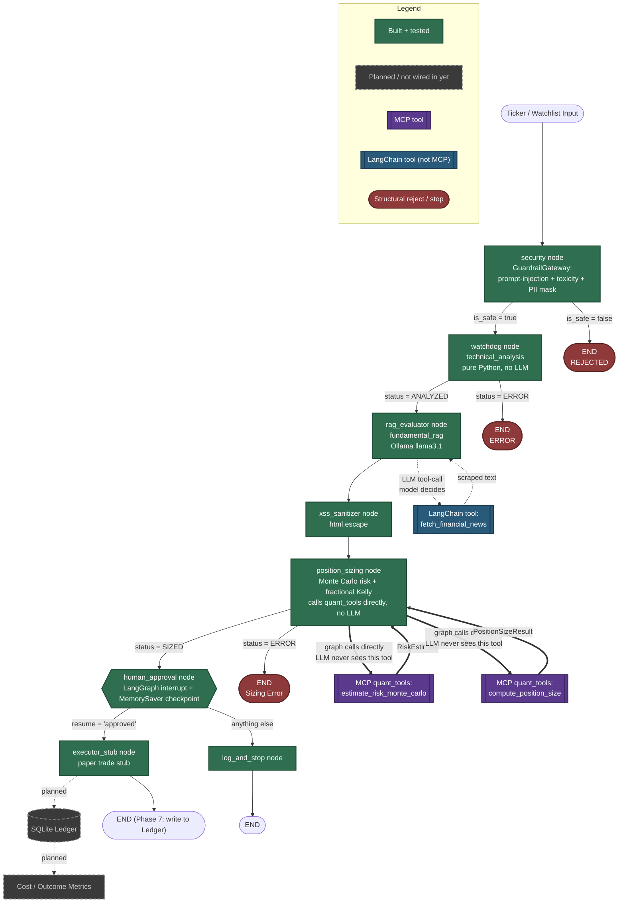

# Market Sentinel — Architecture & MCP Call Map

Auto-generated and kept in sync with the actual repo state as we build. Solid green = built and wired into `graph.py` today. Dashed grey = built as a standalone function or planned, but not yet connected to the graph. Purple = an MCP tool exposed by the `quant_tools` server. Blue = a plain LangChain tool (not MCP). This distinction matters: it shows exactly which nodes are real right now versus which are still ahead of us, and — for the two MCP tools — whether the LLM or the graph itself is the one allowed to call them.

## Reading this diagram in an interview

- The full risk pipeline is now wired end to end: `security → watchdog → rag_evaluator → xss_sanitizer → position_sizing → human_approval → executor_stub / log_and_stop`. All of it is covered by `tests/test_graph_gates.py` (13 tests), which passed 42/42 against the whole suite as of the last run.
- `position_sizing` calls `estimate_risk_monte_carlo` and `compute_position_size` directly as Python functions — both are also exposed through the `quant_tools` MCP server (`src/mcp/server.py`) so they're independently callable over the MCP protocol, but the graph itself never routes through that protocol layer for its own internal calls. That's a deliberate simplicity choice, not an oversight: MCP exposure and "who's allowed to call it" are separate concerns, and the graph gets a direct, zero-latency call for logic that has to run every time regardless of what any LLM decided.
- Neither `estimate_risk_monte_carlo` nor `compute_position_size` is bound to the evaluator LLM via `.bind_tools()` right now — only `fetch_financial_news` is. That's worth being precise about if asked: the earlier plan was for Monte Carlo to be LLM-bindable as an informational tool, but as currently wired, the LLM never sees either quant tool. Kelly sizing was never meant to be LLM-bindable at all (Design Principle 2), and that part is correctly enforced — the function isn't in any `bind_tools()` call anywhere in the codebase.
- `human_approval` genuinely pauses the graph via `interrupt()` and a `MemorySaver` checkpoint — proven, not just claimed, by `test_graph_pauses_at_human_approval_before_executing`, `test_approved_resume_reaches_executor`, and `test_rejected_resume_never_reaches_executor` actually driving a real interrupt/resume cycle.
- `executor_stub` and the SQLite ledger are still separate: the executor currently just prints a paper-trade line and ends the graph. Phase 7 replaces the stub with a real ledger write — that's the next real gap, and it's an honest, visible one on this diagram, not a hidden one.

*This file (and `docs/architecture.html`, the browser-viewable version) is updated automatically as new pieces get built — no need to ask for a refresh.*
