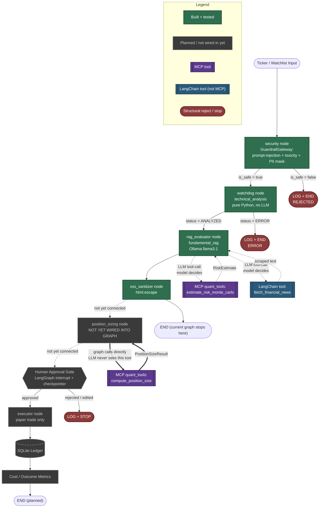

# Market Sentinel — Architecture & MCP Call Map

Auto-generated and kept in sync with the actual repo state as we build. Solid green = built and wired into `graph.py` today. Dashed grey = built as a standalone function or planned, but not yet connected to the graph. Purple = an MCP tool exposed by the `quant_tools` server. Blue = a plain LangChain tool (not MCP). This distinction matters: it shows exactly which nodes are real right now versus which are still ahead of us, and — for the two MCP tools — whether the LLM or the graph itself is the one allowed to call them.

## Reading this diagram in an interview

- The graph as actually wired in `graph.py` today stops at `xss_sanitizer → END`. Everything from `position_sizing` onward is designed but not connected — that's an honest, visible gap, not a hidden one.
- `estimate_risk_monte_carlo` is bound to the evaluator's LLM via `.bind_tools()` — the model decides whether and how to call it. That's safe because it's read-only and informational.
- `compute_position_size` is never bound to the LLM. Only the graph's own deterministic code is meant to call it — this is the structural guardrail from Design Principle 2 in practice, not just a claim.
- `fetch_financial_news` is a plain LangChain tool, not MCP — worth being precise about the difference if asked, since only `quant_tools` is the actual MCP server this project exposes.

*This file (and `docs/architecture.html`, the browser-viewable version) is updated automatically as new pieces get built — no need to ask for a refresh.*
